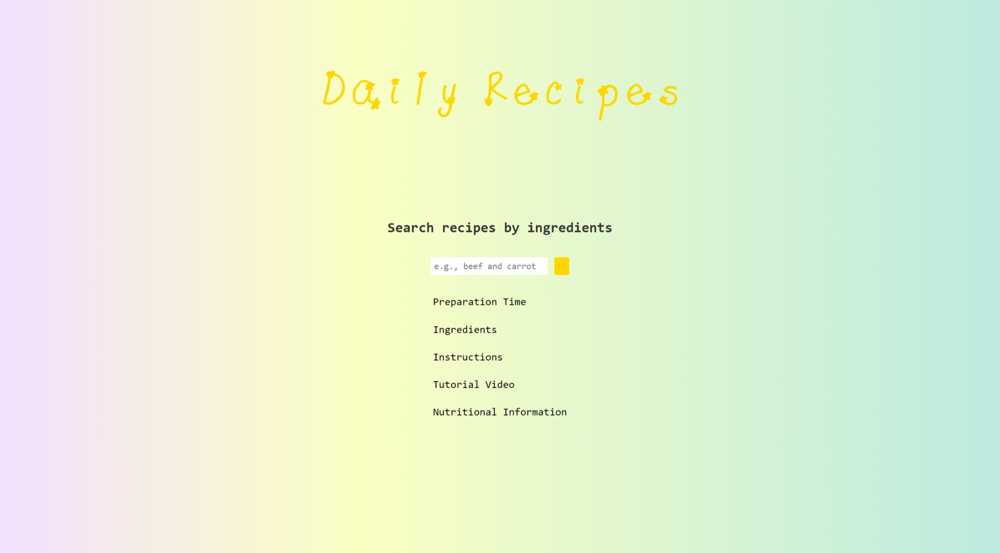

------

# Daily Recipes

This project is a recipe bot application built with Flask, OpenAI, and the Spoonacular API. By inputting a list of ingredients, users receive three recipe suggestions, each showcasing the dish's name, an AI-generated image, and the preparation time. Along with these features, the bot provides a comprehensive cooking experience, including a detailed list of ingredients, step-by-step instructions, a tutorial video link for visual guidance, and a nutritional information table highlighting calories, protein, fat, and carbohydrates.



------

## Features

- **Ingredient-based search:**
   Find recipes based on the ingredients you have on hand.
- **Cooking time limits:**
   Discover recipes that fit your available cooking time.
- **Step-by-step instructions:**
   Clear and concise instructions for cooking each recipe.
- **Nutritional information:**
   Visualize calorie, protein, fat, and carbohydrate breakdowns in a chart.
- **Recipe images:**
   See generated images of the dishes (via DALL-E 3).
- **Tutorial videos:**
   Links to relevant YouTube cooking tutorials.
- **Interactive web interface:**
   Search for recipes and view results on a user-friendly webpage.

------

## Installation

### 1. Clone the repository:

```bash
git clone https://github.com/your-username/DailyRecipes.git
```

Navigate to the project directory:

```bash
cd DailyRecipes
```

### 2. Set up a virtual environment (recommended):

```bash
# Linux/macOS
python3 -m venv venv
source venv/bin/activate

# Windows
python -m venv venv
venv\Scripts\activate
```

### 3. Install dependencies:

```bash
pip install -r requirements.txt
```

### 4. Set up API keys:

#### OpenAI API Key:

Set the `AZURE_KEY` and `AZURE_ENDPOINT` environment variables:

```bash
# Linux/macOS
export AZURE_KEY="YOUR_OPENAI_API_KEY"
export AZURE_ENDPOINT="YOUR_OPENAI_ENDPOINT"

# Windows
set AZURE_KEY="YOUR_OPENAI_API_KEY"
set AZURE_ENDPOINT="YOUR_OPENAI_ENDPOINT"
```

#### Spoonacular API Key:

Create a file named `spoonacularAPI_Key.txt` in the project's root directory and paste your Spoonacular API key into it.

------

## Usage

1. Run the Flask application:

   ```bash
   python Flask run
   ```

2. Open your web browser and navigate to:
    http://127.0.0.1:5000/

3. Enter ingredients into the search bar and click **"Search"**.

4. Search for recipes ...

   

5. Recipes x 3 and further information.

------

## Project Structure

```
recipe_app/
├── app.py                 # Flask application file
├── recipe_bot.py          # Recipe bot logic
├── templates/             # HTML templates
│   └── index.html
└── static/                # Static files (CSS,Fonts)
    ├── styles.css
    ├── fonts/
       └── ...
```

------

## Contributing

Contributions are welcome! Please submit pull requests or open issues to suggest improvements.

------

## License

This project is licensed under the **MIT License**.

------

